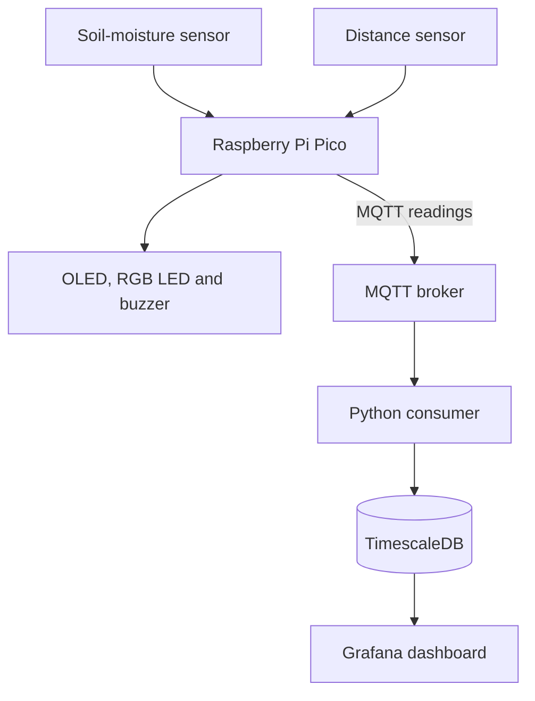

# Plant_Growth_Monitor

 An edge-computing protype that monitors soil moisture and plant growth, provides immediate feedback near the plant, and visualizes sensor readings over time in Grafana.

## About the project

Plant Growth Monitor combines an edge device, sensors, MQTT messaging, a time-series database, and a monitoring dashboard.

The Raspberry PI Pico reads soil-moisture and distance data. It gives local feedback through an OLED display, RGB LED and buzzer, then publishes measurements through MQTT. A Python consumer receives the messages and stores the readings in TimescaleDB. Grafana displays the measurements over time.

The project includes both a Wokwi simulation and code for the Pico-based protype.

## Problem

It is difficult to judge soil moisture accurately by only looking at the surface. Manual checks also provide isolated reading and do not show how conditions change over time.

This prototype explores a more systematic approach by:

- measuring soil moisture regularly;
- estimating plant height from distance readings;
- waring when the measured moisture is low; 
- storing reading for later analysis; and 
- presenting historical measurements in a Grafana dashboard.

The prototype does **not** yet provide universal watering advice. Moisture thresholds and sensor calibration must be adapted and validated for the sensor, soil, and plant being used.

## Main features 

- Soil- moisture measurement 
- Distance measurement for estimating plant height
- Local values shown on an OLED display
- RGB LED moisture indication
- Buzzer alert for dry soil 
- MQTT-based sensor-data transmission
- Python consumer for processing incoming messages
- Time-series storage in TimescaleDB
- Grafana panels for moisture, distance, growth, and plant height
- Wokwi simulation for development and testing
- Docker Compose configuraton for the data pipeline

## System architecture



| Layer | Responsibility |
| --- | --- |
| Sensors | Measure soil moisture and distance |
| Pico | Read sensors, calculate values, control local feedback, and publish data |
| MQTT broker | Transport messages from the edge device to the pipeline |
| Python consumer | Subscribe to sensor messages and write readings to the database |
| TimescaleDB | Store timestamped measurements |
| Grafana | Query and visualize historical readings |

## How it works

1. The Pico reads the soil-moisture sensor and distance sensor.
2. The current result is shown locally through the display, LED, and buzzer.
3. The Pico publishes sensor data using MQTT.
4. The MQTT broker forwards the message to the Python consumer.
5. The consumer writes the reading to TimescaleDB.
6. Grafana queries the database and updates the monitoring panels.

## Technology stack

| Area | Technology |
| --- | --- |
| Edge device | Raspberry Pi Pico with wireless connectivity |
| Device code | MicroPython |
| Simulation | Wokwi |
| Messaging | MQTT and Mosquitto |
| Data consumer | Python |
| Database | PostgreSQL with TimescaleDB |
| Visualization | Grafana |
| Containers | Docker and Docker Compose |
| Cloud target shown in the project material | Microsoft Azure |

## Hardware

The demonstrated design uses the following types of components:

- Raspberry Pi Pico with wifi
- soil-moisture sensor
- ultrasonic distance sensor
- OLED display
- RGB LED 
- Green LED
- passive buzzer
- breadboard, jumper wires, and resistors

## Repository structure
```
Plant_Growth_Monitor/
├── simulation/                 # Wokwi simulation files
├── src_pico/
│   ├── lib/                    # Pico libraries
│   ├── buzzer.py               # Buzzer behavior
│   ├── distance.py             # Distance measurements
│   ├── main.py                 # Pico application entry point
│   ├── moisture.py             # Soil-moisture measurements
│   ├── mqtt.py                 # MQTT communication
│   ├── plant_display.py        # Display and plant feedback
│   └── wifi.py                 # Wi-Fi connection
├── src_pipeline/
│   ├── dockerfiles/            # Container build files
│   ├── mosquitto/              # MQTT broker configuration
│   ├── utils/                  # Pipeline utilities
│   ├── .env                    # Local environment configuration
│   ├── consumer.py             # MQTT consumer and database writer
│   ├── docker-compose.yaml     # Pipeline services
│   ├── pyproject.toml          # Python project configuration
│   └── uv.lock                 # Locked Python dependencies
├── .gitignore
├── README.md
└── way_of_working.md
```


## Dashborard

The demonstrated Grafan dashboard contains four time-series panels:

| Panel | Purpose |
| --- | --- |
| Moisture | Shows the reported soil-moisture values over time |
| Distance | Shows the measured sensor-to-plant distance in centimetres |
| Growth | Shows the calculated change in plant height |
| Plant height | Shows the calculated plant height in centimetres |

## Challenges and limitations

The group identified these technical challenges:

- calibrating the moisture sensor in air and moist soil;
- handling Wi-Fi and MQTT reconnection;
- controlling Docker
Compose startup order with health checks;
- keeping clear responsibilites between modules;
- filtering unstable distance measurements; and 
- testing growth over a long enough period.

Current limitations include:

- no confirmed long-term plant-growth dataset;
- sensor readings depend on calibration and physical placement;
- short-term distance noise can create false height changes;
- the protoype thresholds are not plant-specific; and
- the supplied evidence does not confirm a reproducible publie cloud deployment.

## Future improvents 

- Test the same plant continously for several weeks
- Record calibration values and environmental conditions
- Filter outliers in distance and height measurements
- Add Grafana alerts for dry soil and missing data
- Add secure secret management instead of local credentials
- Add automated tests for message validation and calcuation
- Add persistent Grafan dashboard provisiniong
- Build an enclosure and choose a suitable power supply
- Document and verify the complete Azure deployment process

## Contributors

- Jonas Johansson
- Kevin Bruno
- Sadia Awan

